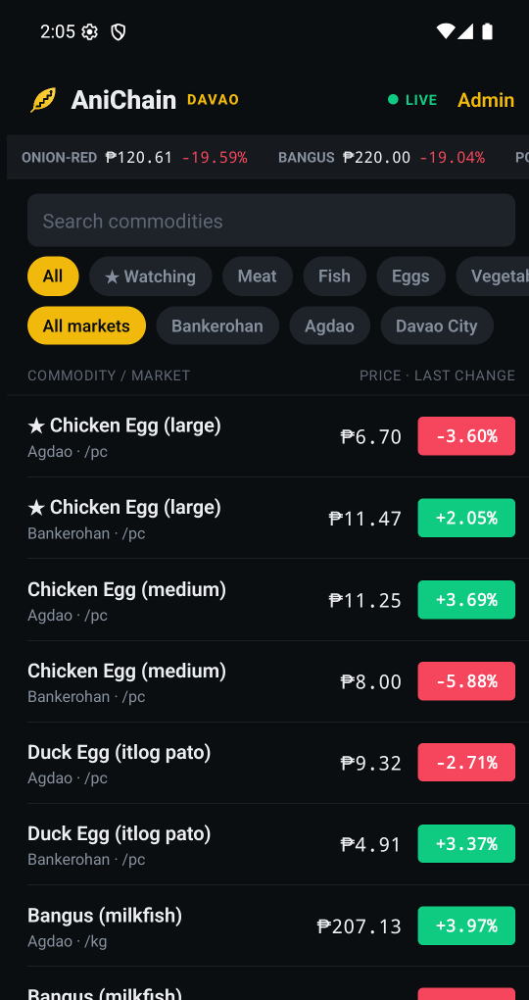
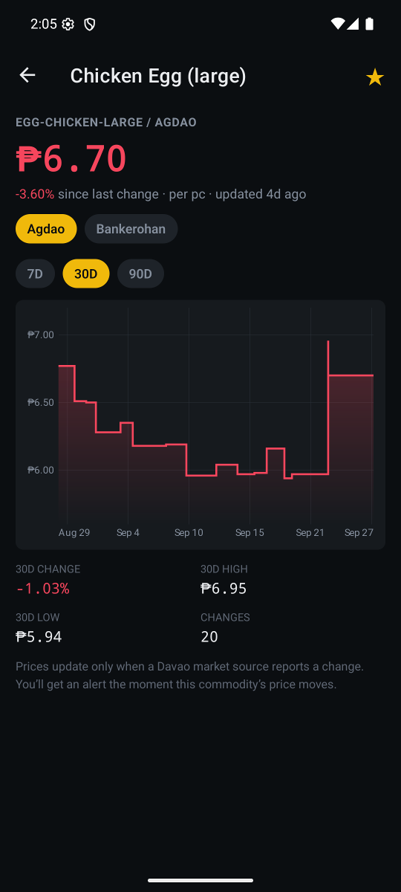
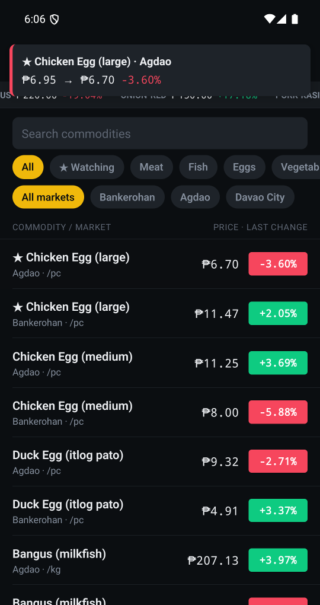
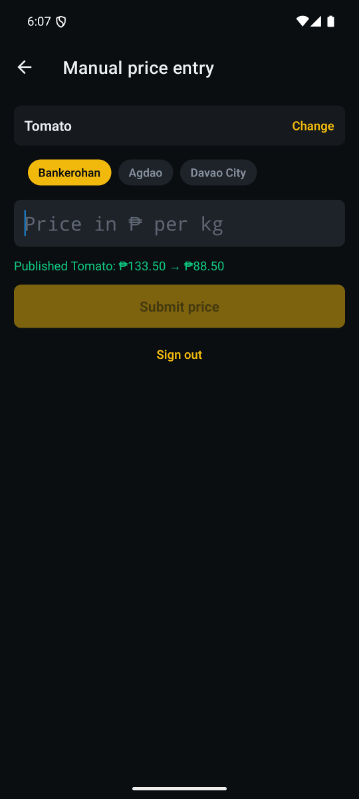
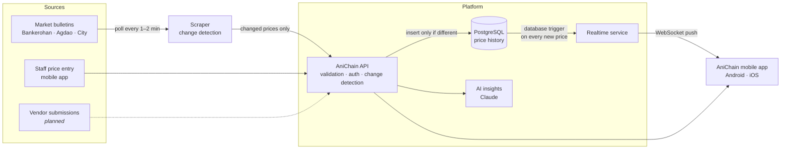

<div align="center">


# AniChain

**Real-time market prices for Davao's food supply.**

A live, exchange-style price tracker for meat, fish, eggs, vegetables and fruits in Davao City's
public markets. It updates the moment a price changes.


[Features](#features) · [How it works](#how-it-works) · [Security](#security-and-data-integrity) ·
[Deployment](#deployment) · [Roadmap](#project-status-and-roadmap) · [Setup guide](docs/SETUP.md)

</div>

---

## The problem

Food prices in Davao's public markets move every day, but the information reaches people slowly.
Shoppers, carinderia owners and small food businesses find out about price changes at the stall.
Market administrators and agriculture offices publish bulletins that are hard to see as a trend.
No single place shows what a kilo of galunggong or tomatoes costs right now, at which market, and
how that compares with last week.

## The solution

AniChain turns market price reports into a live feed, styled like a trading app:

- **One screen for every commodity** at Bankerohan, Agdao and in city-wide bulletins.
- **Changes arrive instantly.** When a price changes, every open app updates within moments, and
  nobody has to refresh.
- **Only real changes are recorded.** If the reported price is the same as before, nothing is
  written and nobody is notified, so the history stays clean and meaningful.
- **Trends in plain language.** An AI summary explains how a price has moved over the last 30 and
  90 days.

<div align="center">

| Live market board | Price history | Instant alerts | Manual price entry |
| :---: | :---: | :---: | :---: |
|  |  |  |  |

<sub>Screenshots use synthetic demo data for illustration. They are not real market prices.</sub>

</div>

## Who it's for

| | How AniChain helps |
| --- | --- |
| **City and provincial agriculture offices** | Publish price bulletins once and have them reach residents' phones immediately, with a clean, auditable history of every change. |
| **Market administrators** | Show live prices across public markets and spot unusual swings early. |
| **Cooperatives and food businesses** | Track the inputs you buy (pork, fish, eggs, vegetables) and get alerted when they move. |
| **Households and shoppers** | Check today's price and compare markets before you go. |
| **Researchers and NGOs** | Work from a change-only time series of food prices across Davao markets. |

## Features

**Live market board**
- Crypto-exchange style ticker with the biggest movers scrolling across the top.
- Every commodity/market pair shows the current price and the % change since its last move.
- Rows flash green or red when a new price arrives.
- Search, category filters (meat, fish, eggs, vegetables, fruits) and market filters.

**Commodity detail**
- Current price, market switcher and 7-, 30- and 90-day step charts. A price holds until it
  changes, so the chart never invents values in between.
- The chart and stats update live as new prices arrive.
- Period high, low, change and number of price moves.

**Watchlist and alerts**
- Star any commodity. When its price changes, an in-app alert appears right away.
- The watchlist is stored on the device, so no account is needed.

**AI price insights**
- A short summary of the price trend, written by Anthropic's Claude from the recorded prices.
- It sticks to the numbers: no invented causes, no forecasts, no buying advice, and it's clearly
  labelled as AI-written.
- Generated once per price change and then cached, which keeps costs predictable.

**Data operations**
- **Automated ingestion:** a scraper polls market sources every 1–2 minutes and submits only
  prices that changed.
- **Manual entry:** authorized staff can enter prices from the mobile app while automated sources
  are being connected.
- **One pipeline for every source:** automated feeds, staff entry and (planned) vendor submissions
  all go through the same change detection, so the rules never differ by source.

**Welcome experience**
- First-launch welcome screens with real photographs of Davao's markets and city from Wikimedia
  Commons, each with full photographer credit and license.

## How it works



1. **Collect:** prices come in from market bulletins, from staff, or later from vendors.
2. **Check:** each price is compared with the last recorded price for that commodity at that
   market. A price that hasn't changed stops here.
3. **Record:** a changed price is saved to the price history.
4. **Broadcast:** the database itself signals each new price, and the realtime service pushes it
   to every connected phone at once. The app never polls.
5. **Explain:** on request, Claude summarizes the recorded trend for a commodity.

## Security and data integrity

- **Role-based access.** Price entry needs a signed login token. Admins can enter prices and
  manage commodities. Automated feeds get a separate, narrower "ingest" role.
- **Credentials on the device** are kept in the phone's secure keychain/keystore, not plain storage.
- **No secrets in the app.** The database password, token-signing secret and AI key stay on the
  server.
- **Scope enforced at the source.** Only approved Davao markets are accepted, and any other
  location is rejected by the API.
- **Consistent under load.** Concurrent submissions for the same commodity are serialized, so two
  identical reports can't both be recorded.
- **Encrypted database connections** with certificate verification on managed PostgreSQL (Aiven).
- **Auditable history.** Every price row records its source (scraper, staff or vendor) and
  timestamp.

## Technology

| Layer | Stack |
| --- | --- |
| Mobile app | Expo SDK 57 (React Native), TypeScript, Expo Router, victory-native + Skia charts, Reanimated, SecureStore |
| API and realtime | Node.js, Hono, WebSockets, Zod validation, JWT auth |
| Data | PostgreSQL (Aiven-ready), Drizzle ORM and migrations, LISTEN/NOTIFY |
| Ingestion | Python 3.11+ (no third-party dependencies), pluggable source adapters |
| AI | Anthropic Claude via the official SDK, server-side only |

## Deployment

AniChain is built for managed cloud infrastructure:

- **Database:** managed PostgreSQL (Aiven or any provider with LISTEN/NOTIFY).
- **API and realtime:** one Node.js service. Run several instances behind a load balancer for
  availability; each instance receives every price update from the database, so no extra message
  broker is needed.
- **Scraper:** a small worker process or scheduled container.
- **Mobile:** built and published to Google Play and the App Store with Expo EAS.

Step-by-step instructions are in the **[setup and operations guide](docs/SETUP.md)**.

## Quick start (local demo)

```bash
# 1. Database
docker run -d --name anichain-pg -e POSTGRES_USER=anichain -e POSTGRES_PASSWORD=anichain \
  -e POSTGRES_DB=anichain -p 5433:5432 postgres:17-alpine

# 2. API (copy .env.example to .env first and fill in the values)
cd backend && npm install && npm run db:migrate && npm run db:seed
npm run db:seed-demo -- --yes   # optional: synthetic demo history
npm run dev

# 3. Mobile app
cd ../mobile && npm install && npx expo start
```

## Project status and roadmap

AniChain is a working **MVP**, ready for a pilot. The whole pipeline runs end to end: ingestion,
change detection, live broadcast, charts, alerts, staff entry and AI insights. It has been checked
with automated end-to-end tests and on Android.

| Status | Item |
| --- | --- |
| ✅ Available | Live ticker, charts, watchlist alerts, staff price entry, AI insights, change-detection pipeline, welcome screens |
| 🔄 In progress | Connecting the official Davao market bulletins as automated sources (staff entry covers this meanwhile) |
| 🗺️ Planned | Crowdsourced vendor price submissions · push notifications when the app is closed · adapters for PDF bulletins · coverage of more Davao Region markets |

AniChain does not include payments or blockchain features.

## Work with us

AniChain can be piloted with a local government unit, market administration, cooperative or
research partner, and adapted to your markets and commodity list. To discuss a pilot, an
integration or a custom deployment, open an issue on this repository or contact
[@Daddyk5](https://github.com/Daddyk5) on GitHub.

## Credits

Welcome-screen photographs come from [Wikimedia Commons](https://commons.wikimedia.org). Their
authors and licenses are listed in [`mobile/src/constants/welcomePhotos.ts`](mobile/src/constants/welcomePhotos.ts)
and shown in the app. AI insights are powered by [Claude](https://www.anthropic.com/claude) from
Anthropic.
